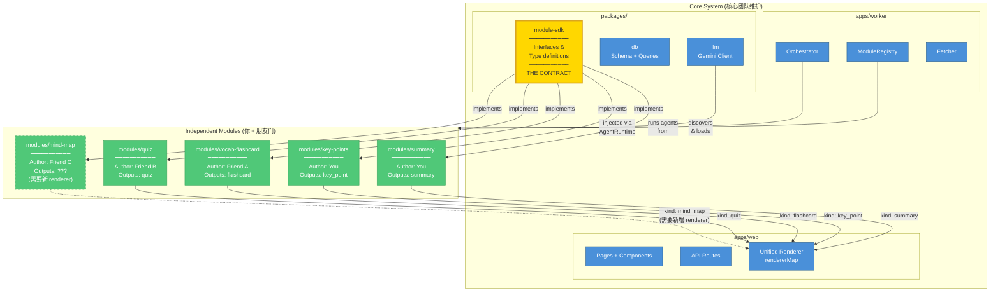

# DinoDigest Module SDK — Developer Guide

> Version: 0.1.0 | Last Updated: 2026-03-25
>
> This document is for module developers. If you're building a new "digestive enzyme"
> for DinoDigest, this is everything you need to know.

## 1. What is a Module?

A module (we call them "digestive enzymes") is an independent unit that processes content and produces structured knowledge outputs. Examples:

- **summary** — Generates a Chinese summary of an English article
- **vocab-flashcard** — Extracts vocabulary words and creates flashcards
- **key-points** — Breaks down an article into individual knowledge points
- **quiz** — Generates comprehension-check questions

Each module is a standalone npm package in the `modules/` directory. You can develop, test, and iterate on a module without touching the rest of the system.

### Module Boundary Overview



You only need to work within the green `modules/` area. The yellow `module-sdk` package defines the contract you must implement.

## 2. Quick Start

### Create a new module

```bash
# From project root
mkdir -p modules/my-module
cd modules/my-module

# Initialize package
cat > package.json << 'EOF'
{
  "name": "@dinodigest/module-my-module",
  "version": "1.0.0",
  "private": true,
  "main": "index.ts",
  "dependencies": {
    "@dinodigest/module-sdk": "workspace:*"
  }
}
EOF

# Install dependencies
cd ../..
pnpm install
```

### Module file structure

```
modules/my-module/
├── package.json       # Package manifest
├── index.ts           # Module definition (entry point)
├── agent.ts           # Agent implementation
├── prompts.ts         # LLM prompt templates
├── schema.ts          # Zod schemas for LLM output validation
└── __tests__/
    └── agent.test.ts  # Unit tests
```

### Minimal implementation

```typescript
// modules/my-module/index.ts

import type { DigestModule } from '@dinodigest/module-sdk'
import { z } from 'zod'
import { MyAgent } from './agent'

const myModule: DigestModule = {
  manifest: {
    id: 'my-module',
    name: 'My Module',
    description: 'Describe what this module does',
    version: '1.0.0',
    author: 'Your Name',
    accepts: {
      contentTypes: ['article'],
      languages: ['en'],
    },
    outputs: ['summary'],  // what output kinds this module produces
  },

  createAgent(runtime) {
    return new MyAgent(runtime)
  },
}

export default myModule
```

```typescript
// modules/my-module/agent.ts

import type { DigestAgent, AgentRuntime, ContentInput, DigestEvent } from '@dinodigest/module-sdk'
import { myOutputSchema } from './schema'
import { buildPrompt } from './prompts'

export class MyAgent implements DigestAgent {
  constructor(private runtime: AgentRuntime) {}

  async *digest(input: ContentInput): AsyncGenerator<DigestEvent> {
    // 1. Report status
    yield { type: 'status', message: 'Starting analysis...' }
    yield { type: 'progress', percent: 10 }

    // 2. Call LLM with structured output
    const result = await this.runtime.llm.generateStructured(
      buildPrompt(input.content, this.runtime.userConfig),
      myOutputSchema,
    )

    yield { type: 'progress', percent: 80 }

    // 3. Emit results
    for (const item of result.items) {
      yield {
        type: 'result',
        output: {
          kind: 'summary',  // must match a registered output kind
          data: {
            title: item.title,
            content: item.content,
            bulletPoints: item.points,
          },
        },
      }
    }

    yield { type: 'progress', percent: 100 }
  }
}
```

## 3. Interface Reference

### ModuleManifest

Declares what your module is and what it can do.

```typescript
interface ModuleManifest {
  /** Unique identifier. Use kebab-case. Example: 'vocab-flashcard' */
  id: string

  /** Human-readable name. Example: 'Vocabulary Flashcards' */
  name: string

  /** Description of what this module does */
  description: string

  /** Semantic version. Example: '1.0.0' */
  version: string

  /** Author name */
  author: string

  /** What content this module can process */
  accepts: {
    /** Content types: 'article' | 'paper' | 'documentation' | 'code' */
    contentTypes: ContentType[]

    /** ISO 639-1 language codes. Omit to accept all languages. */
    languages?: string[]

    /** Minimum content length in words. Omit for no minimum. */
    minContentLength?: number
  }

  /** What output kinds this module produces */
  outputs: OutputType[]

  /** Optional Zod schema for user-configurable settings */
  configSchema?: z.ZodSchema
}
```

### DigestModule

The entry point that the system imports from your module.

```typescript
interface DigestModule {
  manifest: ModuleManifest

  /**
   * Create an agent instance.
   * Called once per digestion job.
   * The runtime provides LLM access, tools, user config, and logging.
   */
  createAgent(runtime: AgentRuntime): DigestAgent
}
```

### DigestAgent

The actual worker that processes content.

```typescript
interface DigestAgent {
  /**
   * Process content and yield events.
   *
   * This is an AsyncGenerator, which means you can:
   * - yield status updates (shown to user in real-time)
   * - yield progress updates (progress bar)
   * - yield partial results (appear as they're generated)
   * - make multiple LLM calls across multiple steps
   *
   * If your agent throws an error, the orchestrator catches it
   * and marks this module as failed. Other modules are NOT affected.
   */
  digest(input: ContentInput): AsyncGenerator<DigestEvent, void, unknown>
}
```

### AgentRuntime

Capabilities provided to your agent by the platform. You never construct this yourself.

```typescript
interface AgentRuntime {
  /** LLM client — abstracted, you don't need to know which model is behind it */
  llm: {
    /** Simple text generation */
    generate(prompt: string): Promise<string>

    /**
     * Structured generation — returns parsed, typed output.
     * Pass a Zod schema and get back a typed object.
     * The platform handles JSON mode, parsing, and validation.
     */
    generateStructured<T>(prompt: string, schema: z.ZodSchema<T>): Promise<T>

    /** Streaming generation — yields text chunks */
    generateStream(prompt: string): AsyncGenerator<string>
  }

  /** Tools your agent can use */
  tools: {
    /** Search the web */
    webSearch(query: string): Promise<SearchResult[]>

    /** Fetch content from a URL */
    fetchUrl(url: string): Promise<string>
  }

  /** User's configuration and preferences */
  userConfig: {
    /** User's native language (ISO 639-1) */
    language: string

    /** User's knowledge level: 'beginner' | 'intermediate' | 'advanced' */
    level: string

    /** Module-specific configuration (from configSchema) */
    moduleConfig: Record<string, unknown>
  }

  /** Logger */
  log: {
    info(message: string): void
    warn(message: string): void
    error(message: string, error?: Error): void
  }
}
```

### ContentInput

What your agent receives as input.

```typescript
interface ContentInput {
  /** Article UUID */
  id: string

  /** Original URL submitted by user */
  sourceUrl: string

  /** Article title (extracted from page) */
  title: string

  /** Clean article text (HTML stripped, ads removed) */
  content: string

  /** Detected language (ISO 639-1) */
  language: string

  /** Content classification */
  contentType: ContentType

  /** Word count */
  wordCount: number

  /** Additional metadata */
  metadata: Record<string, unknown>
}

type ContentType = 'article' | 'paper' | 'documentation' | 'code'
```

### DigestEvent

Events yielded by your agent during processing.

```typescript
type DigestEvent =
  /** Status message shown to the user */
  | { type: 'status';   message: string }

  /** Progress percentage (0-100) */
  | { type: 'progress'; percent: number }

  /** A digested output (can yield multiple) */
  | { type: 'result';   output: DigestOutput }

  /** Error (if recoverable: true, processing continues) */
  | { type: 'error';    error: string; recoverable: boolean }
```

### DigestOutput

Standardized output types. The core system renders these — your module just produces the data.

```typescript
type DigestOutput =
  | {
      kind: 'summary'
      data: {
        title: string
        content: string         // Main summary text
        bulletPoints: string[]  // Key takeaways as bullet list
      }
    }
  | {
      kind: 'key_point'
      data: {
        concept: string         // The concept name
        explanation: string     // Simple explanation
        analogy?: string        // Optional analogy for complex concepts
        difficulty: number      // 1-5 difficulty rating
      }
    }
  | {
      kind: 'flashcard'
      data: {
        front: string           // Card front (word, concept, question)
        back: string            // Card back (answer, definition, explanation)
        tags: string[]          // Tags for organization
      }
    }
  | {
      kind: 'quiz'
      data: {
        question: string        // The question
        options: string[]       // Answer choices (typically 4)
        correctIndex: number    // Index of correct answer (0-based)
        explanation: string     // Why the correct answer is correct
      }
    }
```

**Important**: If you need a new output `kind` that doesn't exist yet, coordinate with the core team. A new renderer component needs to be added to the core app.

## 4. Complete Module Example: Vocabulary Flashcards

This is a full, production-ready example of a module.

### index.ts

```typescript
import type { DigestModule } from '@dinodigest/module-sdk'
import { z } from 'zod'
import { VocabAgent } from './agent'

const vocabFlashcardModule: DigestModule = {
  manifest: {
    id: 'vocab-flashcard',
    name: 'Vocabulary Flashcards',
    description: 'Extracts difficult vocabulary from English content and generates flashcards with Chinese translations, IPA pronunciation, and contextual examples.',
    version: '1.0.0',
    author: 'DinoDigest Team',
    accepts: {
      contentTypes: ['article', 'documentation', 'paper'],
      languages: ['en'],
      minContentLength: 200,
    },
    outputs: ['flashcard'],
    configSchema: z.object({
      maxCards: z.number().min(5).max(30).default(15),
      difficulty: z.enum(['beginner', 'intermediate', 'advanced']).default('intermediate'),
      includeIPA: z.boolean().default(true),
    }),
  },

  createAgent(runtime) {
    return new VocabAgent(runtime)
  },
}

export default vocabFlashcardModule
```

### schema.ts

```typescript
import { z } from 'zod'

export const VocabWordSchema = z.object({
  word: z.string(),
  ipa: z.string(),
  partOfSpeech: z.string(),
  translation: z.string(),
  definition: z.string(),
  example: z.string(),
  contextSentence: z.string(),
  difficulty: z.enum(['basic', 'intermediate', 'advanced']),
})

export const VocabListSchema = z.object({
  words: z.array(VocabWordSchema),
  articleDifficulty: z.enum(['easy', 'medium', 'hard']),
})

export type VocabWord = z.infer<typeof VocabWordSchema>
export type VocabList = z.infer<typeof VocabListSchema>
```

### prompts.ts

```typescript
export function buildVocabPrompt(
  content: string,
  config: { maxCards: number; difficulty: string }
): string {
  return `You are a vocabulary extraction expert helping Chinese students learn English.

Analyze the following article and extract ${config.maxCards} vocabulary words that would be challenging for a ${config.difficulty}-level Chinese English learner.

For each word, provide:
- word: the vocabulary word
- ipa: IPA pronunciation (e.g., /ˈhɪd.rə.ʃən/)
- partOfSpeech: noun, verb, adjective, etc.
- translation: concise Chinese translation
- definition: clear English definition (1 sentence)
- example: a new example sentence using the word (not from the article)
- contextSentence: the actual sentence from the article where the word appears
- difficulty: basic, intermediate, or advanced

Also rate the overall article difficulty as easy, medium, or hard.

Selection criteria:
- Skip common words (the, is, have, etc.)
- Prioritize domain-specific terms and academic vocabulary
- Include words that appear in important sentences
- For ${config.difficulty} level:
  - beginner: focus on common but non-trivial words
  - intermediate: include some technical and academic terms
  - advanced: focus on nuanced, rare, or highly technical terms

Article:
---
${content}
---`
}
```

### agent.ts

```typescript
import type {
  DigestAgent,
  AgentRuntime,
  ContentInput,
  DigestEvent,
} from '@dinodigest/module-sdk'
import { VocabListSchema } from './schema'
import { buildVocabPrompt } from './prompts'

interface VocabConfig {
  maxCards: number
  difficulty: string
  includeIPA: boolean
}

export class VocabAgent implements DigestAgent {
  private config: VocabConfig

  constructor(private runtime: AgentRuntime) {
    this.config = {
      maxCards: 15,
      difficulty: 'intermediate',
      includeIPA: true,
      ...(runtime.userConfig.moduleConfig as Partial<VocabConfig>),
    }
  }

  async *digest(input: ContentInput): AsyncGenerator<DigestEvent> {
    // Step 1: Validate input
    if (input.language !== 'en') {
      yield {
        type: 'error',
        error: 'Vocab flashcard module only supports English content',
        recoverable: false,
      }
      return
    }

    this.runtime.log.info(`Processing article: ${input.title} (${input.wordCount} words)`)

    // Step 2: Extract vocabulary via LLM
    yield { type: 'status', message: 'Analyzing vocabulary...' }
    yield { type: 'progress', percent: 10 }

    const prompt = buildVocabPrompt(input.content, this.config)

    let vocabResult
    try {
      vocabResult = await this.runtime.llm.generateStructured(prompt, VocabListSchema)
    } catch (err) {
      yield {
        type: 'error',
        error: `LLM generation failed: ${err}`,
        recoverable: false,
      }
      return
    }

    yield { type: 'progress', percent: 60 }
    yield {
      type: 'status',
      message: `Found ${vocabResult.words.length} vocabulary words`,
    }

    // Step 3: Emit each flashcard as a result
    const total = vocabResult.words.length
    for (let i = 0; i < total; i++) {
      const word = vocabResult.words[i]

      const front = this.config.includeIPA
        ? `${word.word}  [${word.ipa}]`
        : word.word

      const backLines = [
        `**${word.translation}** (${word.partOfSpeech})`,
        '',
        word.definition,
        '',
        `Example: _${word.example}_`,
        '',
        `Context: "${word.contextSentence}"`,
      ]

      yield {
        type: 'result',
        output: {
          kind: 'flashcard',
          data: {
            front,
            back: backLines.join('\n'),
            tags: ['vocab', word.difficulty, input.id],
          },
        },
      }

      yield { type: 'progress', percent: 60 + ((i + 1) / total) * 40 }
    }

    this.runtime.log.info(`Generated ${total} flashcards`)
  }
}
```

### __tests__/agent.test.ts

```typescript
import { describe, it, expect, vi } from 'vitest'
import { VocabAgent } from '../agent'
import type { AgentRuntime, ContentInput } from '@dinodigest/module-sdk'

function createMockRuntime(overrides?: Partial<AgentRuntime>): AgentRuntime {
  return {
    llm: {
      generate: vi.fn(),
      generateStructured: vi.fn().mockResolvedValue({
        words: [
          {
            word: 'hydration',
            ipa: '/haɪˈdreɪʃən/',
            partOfSpeech: 'noun',
            translation: '水合',
            definition: 'The process of attaching event handlers to server-rendered HTML.',
            example: 'React hydration happens on the client side.',
            contextSentence: 'The hydration process attaches event handlers to the static HTML.',
            difficulty: 'intermediate',
          },
        ],
        articleDifficulty: 'medium',
      }),
      generateStream: vi.fn(),
    },
    tools: {
      webSearch: vi.fn(),
      fetchUrl: vi.fn(),
    },
    userConfig: {
      language: 'zh',
      level: 'intermediate',
      moduleConfig: {},
    },
    log: {
      info: vi.fn(),
      warn: vi.fn(),
      error: vi.fn(),
    },
    ...overrides,
  }
}

function createMockInput(overrides?: Partial<ContentInput>): ContentInput {
  return {
    id: 'test-article-id',
    sourceUrl: 'https://example.com/react-rsc',
    title: 'Understanding React Server Components',
    content: 'React Server Components allow rendering on the server...',
    language: 'en',
    contentType: 'article',
    wordCount: 500,
    metadata: {},
    ...overrides,
  }
}

describe('VocabAgent', () => {
  it('should generate flashcards from English content', async () => {
    const runtime = createMockRuntime()
    const agent = new VocabAgent(runtime)
    const input = createMockInput()

    const events: any[] = []
    for await (const event of agent.digest(input)) {
      events.push(event)
    }

    const results = events.filter(e => e.type === 'result')
    expect(results).toHaveLength(1)
    expect(results[0].output.kind).toBe('flashcard')
    expect(results[0].output.data.front).toContain('hydration')
    expect(results[0].output.data.back).toContain('水合')
  })

  it('should reject non-English content', async () => {
    const runtime = createMockRuntime()
    const agent = new VocabAgent(runtime)
    const input = createMockInput({ language: 'zh' })

    const events: any[] = []
    for await (const event of agent.digest(input)) {
      events.push(event)
    }

    const errors = events.filter(e => e.type === 'error')
    expect(errors).toHaveLength(1)
    expect(errors[0].recoverable).toBe(false)
  })

  it('should emit progress events', async () => {
    const runtime = createMockRuntime()
    const agent = new VocabAgent(runtime)
    const input = createMockInput()

    const events: any[] = []
    for await (const event of agent.digest(input)) {
      events.push(event)
    }

    const progressEvents = events.filter(e => e.type === 'progress')
    expect(progressEvents.length).toBeGreaterThan(0)

    const lastProgress = progressEvents[progressEvents.length - 1]
    expect(lastProgress.percent).toBe(100)
  })
})
```

## 5. Development Workflow

### Running locally

```bash
# From project root
pnpm install

# Start all services (web + worker)
pnpm dev

# Or start just what you need for module development
pnpm --filter worker dev   # Start the worker
pnpm --filter web dev      # Start the web app (optional)
```

### Testing your module

```bash
# Run tests for your module only
pnpm --filter @dinodigest/module-my-module test

# Run tests for all modules
pnpm --filter "./modules/**" test

# Run all tests
pnpm test
```

### Module checklist before PR

- [ ] `manifest.id` is unique (no duplicates with existing modules)
- [ ] `manifest.accepts` is correctly configured (don't accept content you can't process)
- [ ] `manifest.outputs` lists all kinds your agent yields
- [ ] Agent yields `progress` events (0 at start, 100 at end)
- [ ] Agent yields at least one `status` event
- [ ] Agent handles errors gracefully (yield error event, don't throw)
- [ ] Prompts are in a separate `prompts.ts` file
- [ ] Output schemas are in a separate `schema.ts` file with Zod
- [ ] Tests cover: happy path, wrong language/content type, LLM failure
- [ ] No hardcoded API keys or credentials
- [ ] `package.json` has `@dinodigest/module-sdk` as dependency

## 6. Common Patterns

### Multi-step agent

If your agent needs multiple LLM calls:

```typescript
async *digest(input: ContentInput): AsyncGenerator<DigestEvent> {
  // Step 1: Analyze
  yield { type: 'status', message: 'Step 1: Analyzing content...' }
  yield { type: 'progress', percent: 10 }
  const analysis = await this.runtime.llm.generateStructured(prompt1, schema1)

  // Step 2: Deep dive based on analysis
  yield { type: 'status', message: 'Step 2: Extracting details...' }
  yield { type: 'progress', percent: 40 }
  const details = await this.runtime.llm.generateStructured(
    buildDetailPrompt(analysis),
    schema2,
  )

  // Step 3: Generate output
  yield { type: 'status', message: 'Step 3: Generating output...' }
  yield { type: 'progress', percent: 70 }

  for (const item of details.items) {
    yield { type: 'result', output: { kind: 'key_point', data: item } }
  }

  yield { type: 'progress', percent: 100 }
}
```

### Using tools (web search)

```typescript
async *digest(input: ContentInput): AsyncGenerator<DigestEvent> {
  yield { type: 'status', message: 'Researching related topics...' }

  // Use the built-in web search tool
  const relatedInfo = await this.runtime.tools.webSearch(
    `${input.title} explained simply`
  )

  // Use search results to enrich the prompt
  const enrichedPrompt = buildPrompt(input.content, relatedInfo)
  const result = await this.runtime.llm.generateStructured(enrichedPrompt, schema)

  // ...emit results
}
```

### Chunking long content

For very long articles, you may need to process in chunks:

```typescript
async *digest(input: ContentInput): AsyncGenerator<DigestEvent> {
  const chunks = splitIntoChunks(input.content, 3000) // ~3000 words per chunk

  const allResults = []
  for (let i = 0; i < chunks.length; i++) {
    yield {
      type: 'status',
      message: `Processing section ${i + 1}/${chunks.length}...`,
    }
    yield { type: 'progress', percent: (i / chunks.length) * 80 }

    const result = await this.runtime.llm.generateStructured(
      buildPrompt(chunks[i]),
      schema,
    )
    allResults.push(...result.items)
  }

  // Deduplicate and emit
  const unique = deduplicateResults(allResults)
  for (const item of unique) {
    yield { type: 'result', output: { kind: 'key_point', data: item } }
  }

  yield { type: 'progress', percent: 100 }
}
```

## 7. FAQ

**Q: Can my module produce multiple output kinds?**
A: Yes. Set `outputs: ['summary', 'key_point']` in the manifest and yield both kinds from your agent.

**Q: Can I bring my own frontend component?**
A: No. All rendering is handled by the core app's unified renderer system. Your module only produces data. If you need a new output kind, coordinate with the core team to add a new renderer.

**Q: What happens if my agent crashes?**
A: The orchestrator wraps each agent in error isolation. If your agent throws, only your module fails. Other modules continue normally. The user sees "Module X failed" with an option to retry.

**Q: Can I make multiple LLM calls?**
A: Yes. Use `this.runtime.llm` as many times as needed. Just remember to yield progress events so the user knows your agent is still working.

**Q: How do I access user preferences?**
A: Via `this.runtime.userConfig`. The `moduleConfig` field contains settings specific to your module (defined by your `configSchema`).

**Q: Can I use npm packages?**
A: Yes. Add them to your module's `package.json`. However, avoid heavy dependencies that increase install time.

**Q: How do I test with a real LLM?**
A: Set up your `.env` with Vertex AI credentials and run the worker locally. For unit tests, always mock `AgentRuntime` (see the test example above).
