# DinoDigest — Product Requirements Document

> Version: 0.1.0 | Last Updated: 2026-03-25

## 1. Product Vision

DinoDigest is a knowledge digestion tool that transforms raw content into learnable, structured knowledge. Users paste a URL, and a dinosaur mascot "eats" the content, "chews" it through AI-powered agents, and "digests" it into summaries, flashcards, key points, and quizzes.

**One-liner**: From "I bookmarked it" to "I understood it" — automatically.

## 2. Core Metaphor

The dinosaur metaphor is the brand identity, not just decoration. It defines the product's information architecture and interaction language:

| Traditional Term | DinoDigest Term |
|---|---|
| Upload / Submit | Feed (投喂) |
| Processing | Chewing (咀嚼) |
| Results | Digested Knowledge (消化结果) |
| Knowledge Base | Knowledge Stomach (知识胃) |
| Plugins / Modules | Digestive Enzymes (消化酶) |
| Review | Absorb (吸收) |

## 3. Target Users

### MVP Target
- **Primary**: Students reading English technical blogs
- **Pain points**:
  - Vocabulary barriers when reading English articles
  - Understanding technical concepts in a foreign language
  - Forgetting what they read (no retention system)
  - Collected many bookmarks but never revisited them

### Future Expansion
- Knowledge workers (product managers, designers)
- Developers reading documentation
- Lifelong learners consuming diverse content

## 4. MVP Scope

### In Scope
- Web app with URL input (paste a blog link)
- Content extraction from URLs
- AI-powered digestion via modular agent system
- Four digest types: Summary, Key Points, Vocabulary Flashcards, Quiz
- Flashcard review with SM-2 spaced repetition
- Article history list
- Real-time processing status (SSE)
- Bilingual UI (English / Chinese)
- No login required (device-based identification)

### Out of Scope (MVP)
- WeChat integration
- Browser extension
- User authentication / login
- Sharing digested results
- Video/audio content processing
- Knowledge graph / cross-article linking
- Custom user-developed modules (SDK provided, but no marketplace)

## 5. User Journey

```mermaid
flowchart TD
    START((User visits<br/>DinoDigest)) --> HOME

    subgraph HOME_FLOW["Home Page"]
        HOME["See dinosaur 🦕<br/>with open mouth"]
        HOME --> PASTE["Paste blog URL<br/>into input field"]
        PASTE --> CLICK_FEED["Click 'Feed 🦕' button"]
    end

    CLICK_FEED --> VALIDATE{URL valid?}
    VALIDATE -->|No| ERROR_URL["Show inline error:<br/>'Please enter a valid URL'"]
    ERROR_URL --> PASTE

    VALIDATE -->|Yes| SUBMIT

    subgraph SERVER_INGEST["Server: POST /api/ingest"]
        SUBMIT["Create article record<br/>status: pending"]
        SUBMIT --> QUEUE["Add job to<br/>BullMQ queue"]
        QUEUE --> RETURN_ID["Return articleId"]
    end

    RETURN_ID --> REDIRECT["Redirect to<br/>/digest/:id"]

    subgraph PROCESSING_FLOW["Processing Page"]
        REDIRECT --> SHOW_CHEWING["Show dinosaur<br/>chewing animation 🦕"]
        SHOW_CHEWING --> SSE_CONNECT["Connect SSE<br/>EventSource"]
        SSE_CONNECT --> LISTEN["Listen for<br/>digest events"]
    end

    subgraph WORKER_FLOW["Worker: Background Processing"]
        QUEUE --> PICK_JOB["BullMQ worker<br/>picks up job"]
        PICK_JOB --> FETCH["Fetcher:<br/>URL → HTML → Clean text"]

        FETCH --> FETCH_OK{Extract<br/>success?}
        FETCH_OK -->|No| FETCH_FAIL["Mark article 'failed'<br/>Emit error event"]
        FETCH_OK -->|Yes| DETECT_LANG["Detect language"]

        DETECT_LANG --> FIND_MODULES["ModuleRegistry:<br/>findApplicable(input)"]
        FIND_MODULES --> RUN_PARALLEL["Run all applicable<br/>module agents in parallel"]

        subgraph PARALLEL_AGENTS["Parallel Agent Execution"]
            direction LR
            AGENT_S["Summary Agent"]
            AGENT_K["KeyPoints Agent"]
            AGENT_V["Vocab Agent"]
            AGENT_Q["Quiz Agent"]
        end

        RUN_PARALLEL --> PARALLEL_AGENTS

        AGENT_S --> |"status / progress / result events"| EVENT_BUS["Event Bus<br/>(Redis pub/sub)"]
        AGENT_K --> EVENT_BUS
        AGENT_V --> EVENT_BUS
        AGENT_Q --> EVENT_BUS

        subgraph AGENT_DETAIL["Each Agent Internally"]
            direction TB
            A_START["Receive ContentInput"] --> A_PROMPT["Build prompt<br/>from prompts.ts"]
            A_PROMPT --> A_LLM["Call Gemini API<br/>generateStructured()"]
            A_LLM --> A_PARSE["Parse & validate<br/>with Zod schema"]
            A_PARSE --> A_EMIT["Yield DigestOutput<br/>results"]
            A_EMIT --> A_SAVE["Orchestrator saves<br/>to digests table"]
            A_SAVE --> A_FLASH{kind ==<br/>flashcard?}
            A_FLASH -->|Yes| A_SAVE_CARD["Also save to<br/>flashcards table"]
            A_FLASH -->|No| A_DONE["Done"]
            A_SAVE_CARD --> A_DONE
        end

        PARALLEL_AGENTS --> ALL_DONE["All agents complete"]
        ALL_DONE --> MARK_DONE["Mark article 'done'<br/>Emit completion event"]
    end

    EVENT_BUS -->|"SSE push"| LISTEN

    subgraph STATUS_UPDATES["Real-time UI Updates"]
        LISTEN --> UPDATE_LIST["Update agent<br/>status list"]
        UPDATE_LIST --> CHECK_DONE{All agents<br/>done?}
        CHECK_DONE -->|No| LISTEN
    end

    FETCH_FAIL -->|"SSE error"| SHOW_ERROR["Show error state:<br/>'Could not extract content'<br/>[Retry] button"]
    SHOW_ERROR --> CLICK_FEED

    CHECK_DONE -->|Yes| SHOW_HAPPY["Dinosaur happy 🦕<br/>animation"]
    SHOW_HAPPY --> AUTO_REDIRECT["Auto-navigate to<br/>result view"]

    subgraph RESULT_FLOW["Digest Result Page"]
        AUTO_REDIRECT --> SHOW_TABS["Show tab bar:<br/>Summary | KeyPoints |<br/>Flashcards | Quiz"]
        SHOW_TABS --> TAB_SELECT{User selects tab}

        TAB_SELECT -->|Summary| RENDER_SUMMARY["SummaryRenderer:<br/>Title + Chinese summary +<br/>Bullet points"]
        TAB_SELECT -->|Key Points| RENDER_KP["KeyPointRenderer:<br/>Concept cards with<br/>explanation + analogy"]
        TAB_SELECT -->|Flashcards| RENDER_FC["FlashcardRenderer:<br/>Preview of generated cards<br/>[Start Review →]"]
        TAB_SELECT -->|Quiz| RENDER_QUIZ["QuizRenderer:<br/>Multiple choice questions<br/>with reveal"]
    end

    RENDER_FC --> START_REVIEW["Click 'Start Review'"]

    subgraph REVIEW_FLOW["Flashcard Review Page"]
        START_REVIEW --> FETCH_DUE["GET /api/review/due<br/>Fetch due cards"]
        FETCH_DUE --> HAS_CARDS{Cards due?}

        HAS_CARDS -->|No| EMPTY_STATE["Dinosaur says:<br/>'All caught up! 🎉'"]
        EMPTY_STATE --> GO_HOME["← Back to Home"]

        HAS_CARDS -->|Yes| SHOW_CARD["Show card front:<br/>word + IPA"]
        SHOW_CARD --> TAP_FLIP["User taps to flip"]
        TAP_FLIP --> SHOW_BACK["Show card back:<br/>translation + example +<br/>original context"]
        SHOW_BACK --> RATE{User rates}

        RATE -->|Again| SCORE_0["quality = 0<br/>Reset interval"]
        RATE -->|Hard| SCORE_3["quality = 3<br/>Short interval"]
        RATE -->|Good| SCORE_4["quality = 4<br/>Normal interval"]
        RATE -->|Easy| SCORE_5["quality = 5<br/>Long interval"]

        SCORE_0 --> SM2["SM-2 Algorithm:<br/>Calculate new interval<br/>& easeFactor"]
        SCORE_3 --> SM2
        SCORE_4 --> SM2
        SCORE_5 --> SM2

        SM2 --> SAVE_SCORE["POST /api/review/score<br/>Update nextReviewAt"]
        SAVE_SCORE --> MORE_CARDS{More cards?}
        MORE_CARDS -->|Yes| SHOW_CARD
        MORE_CARDS -->|No| REVIEW_DONE["Review complete!<br/>Dinosaur celebrates 🦕"]
    end

    REVIEW_DONE --> NEXT_ACTION{User decides}
    GO_HOME --> HOME
    RENDER_SUMMARY --> BACK_HOME["← Back to History"]
    RENDER_KP --> BACK_HOME
    RENDER_QUIZ --> BACK_HOME
    BACK_HOME --> HISTORY_PAGE

    subgraph HISTORY_FLOW["History Page (Knowledge Stomach)"]
        HISTORY_PAGE["List all digested<br/>articles by date"]
        HISTORY_PAGE --> CLICK_ARTICLE["Click an article"]
        CLICK_ARTICLE --> AUTO_REDIRECT
        HISTORY_PAGE --> DUE_BANNER["Banner: 'X cards<br/>due for review'"]
        DUE_BANNER --> START_REVIEW
    end

    NEXT_ACTION -->|"Feed more"| HOME
    NEXT_ACTION -->|"Browse history"| HISTORY_PAGE

    %% Styling
    classDef startEnd fill:#4A90D9,stroke:#2C5F8A,color:#fff,stroke-width:2px
    classDef process fill:#FFFFFF,stroke:#333,color:#333
    classDef decision fill:#FFD700,stroke:#DAA520,color:#333
    classDef error fill:#FF6B6B,stroke:#D94545,color:#fff
    classDef success fill:#50C878,stroke:#3BA55D,color:#fff
    classDef server fill:#E8A838,stroke:#C8882A,color:#fff
    classDef worker fill:#7B68EE,stroke:#5B48CE,color:#fff

    class START startEnd
    class VALIDATE,FETCH_OK,CHECK_DONE,TAB_SELECT,RATE,HAS_CARDS,MORE_CARDS,NEXT_ACTION,A_FLASH decision
    class ERROR_URL,SHOW_ERROR,FETCH_FAIL error
    class SHOW_HAPPY,REVIEW_DONE,ALL_DONE,MARK_DONE,EMPTY_STATE success
    class SUBMIT,QUEUE,RETURN_ID server
    class PICK_JOB,FETCH,DETECT_LANG,FIND_MODULES,RUN_PARALLEL,AGENT_S,AGENT_K,AGENT_V,AGENT_Q worker
```

## 6. Page Designs

### Page 1: Home — Feed Input

The dinosaur is centered with its mouth open. The URL input field is positioned inside the mouth area. A "Feed" button triggers submission.

Below the input: a "Recently Digested" section showing the last 3-6 articles as cards.

**Key elements:**
- Dinosaur illustration (idle state, mouth open)
- URL input field (prominent, centered)
- "Feed" button
- Recent articles grid
- "X cards due for review" banner (if applicable)

### Page 2: Processing — Chewing Status

After submission, the user sees a chewing dinosaur animation and a list of active agents with their status.

**Key elements:**
- Dinosaur illustration (chewing state, animated)
- Article title being processed
- Agent status list:
  - Each agent shows: icon + name + status (queued / working / done / failed)
  - Status updates in real-time via SSE
- Cancel button

### Page 3: Digest Result

Tabbed view of all digested content from a single article.

**Key elements:**
- Article metadata (title, source URL, word count, timestamp)
- Tab bar: Summary | Key Points | Flashcards | Quiz
- Each tab renders using the unified renderer system
- "Start Review" button for flashcards
- Back to history link

### Page 4: Flashcard Review

Full-screen flashcard review interface with SM-2 scoring.

**Key elements:**
- Single card display (tap/click to flip)
- Front: word + pronunciation
- Back: translation + example sentence + original context
- Rating buttons: Again / Hard / Good / Easy
- Progress: "X cards remaining"
- Dinosaur encouragement messages

### Page 5: Knowledge Stomach — History

Chronological list of all digested articles, with search.

**Key elements:**
- Search bar (keyword search)
- Filter: All / Articles / Flashcards
- Article cards grouped by date
- Each card shows: title, digest stats (X key points, Y flashcards)
- "Due for review: X cards" banner with CTA

## 7. Dinosaur Design Specifications

### Visual Style
- Simple line-art / flat illustration style
- Friendly, approachable expression
- Consistent across all states
- Source: Open-source SVG illustrations

### Required States (CSS animated)
| State | Description | Used On |
|---|---|---|
| Idle / Mouth Open | Waiting for food, mouth open wide | Home page |
| Chewing | Mouth opening and closing rhythmically | Processing page |
| Happy / Satisfied | Content expression, possibly with sparkles | Digest complete |
| Encouraging | Small dinosaur beside text | Review page |

### Animation Approach
- Static SVG illustrations
- CSS transitions for state changes (mouth open/close, eye blink)
- Framer Motion for page transitions
- No Lottie or complex animation frameworks in MVP

## 8. Feature Priority Matrix

### P0 — Must Have (MVP)
| Feature | Description |
|---|---|
| URL Input | Paste a link, submit for processing |
| Content Extraction | URL to clean text (readability + defuddle) |
| Summary Module | Article to Chinese structured summary |
| Key Points Module | Article to individual knowledge points |
| Vocab Flashcard Module | English article to vocabulary cards |
| Digest Result Page | View all digested content with tabs |
| Processing Status | Real-time agent status via SSE |
| Flashcard Review | SM-2 spaced repetition review |
| Article History | List of all digested articles |
| i18n | English and Chinese UI |

### P1 — Should Have (Post-MVP)
| Feature | Description |
|---|---|
| Quiz Module | Comprehension check questions |
| Search | Keyword search across articles |
| Review Reminders | "X cards due" notifications |
| Mobile Optimization | Responsive design for phones |
| Error Recovery | Retry failed modules individually |

### P2 — Nice to Have (Future)
| Feature | Description |
|---|---|
| User Authentication | Google OAuth login |
| Browser Extension | One-click save from any page |
| WeChat Integration | Forward messages to digest |
| Sharing | Public URLs for digest results |
| Knowledge Graph | Cross-article concept linking |
| Video/Audio Support | YouTube, podcast digestion |
| Module Marketplace | Community-developed modules |

## 9. Competitive Landscape

| Product | What it does | DinoDigest's differentiation |
|---|---|---|
| Readwise | Highlight sync + simple summaries | Passive collection, no deep digestion |
| Notion AI | AI operations within documents | Requires manual organization |
| Anki | Manual flashcard creation | DinoDigest auto-generates from content |
| Quillbot / DeepL | Translation | Only translates, doesn't extract knowledge |
| Obsidian + AI plugins | Note-taking with AI | Requires setup, not automated pipeline |

**Core value proposition**: DinoDigest is the automatic bridge from "I saved it" to "I understood it."

## 10. Success Metrics (Post-Launch)

| Metric | Target | Rationale |
|---|---|---|
| Articles digested per user/week | >= 3 | Core engagement |
| Flashcard review rate | >= 50% of generated cards reviewed | Retention feature adoption |
| Return rate (7-day) | >= 40% | Product stickiness |
| Time to first digest | < 60 seconds | Onboarding friction |
| Digest quality rating | >= 4/5 (if feedback added) | Core value delivery |

## 11. Key Decisions Log

| Date | Decision | Rationale |
|---|---|---|
| 2026-03-25 | MVP: Web input only, no WeChat | Reduce scope, validate core value first |
| 2026-03-25 | No login for MVP | Minimize friction, fastest path to value |
| 2026-03-25 | Dinosaur as brand mascot | Memorable, fun, maps naturally to digestion |
| 2026-03-25 | i18n from day one (EN/ZH) | Target users are Chinese students reading English content |
| 2026-03-25 | Modules render via core system | Simpler architecture, consistent UX |
| 2026-03-25 | Open-source dinosaur illustrations | Fast to implement, no design dependency |
| 2026-03-25 | SM-2 for flashcard review | Proven algorithm, simple to implement |
| 2026-03-25 | No sharing in MVP | Focus on personal use first |
